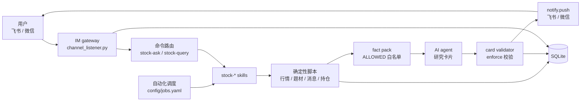
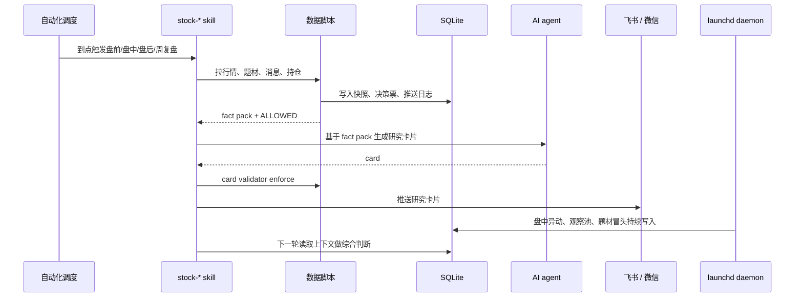
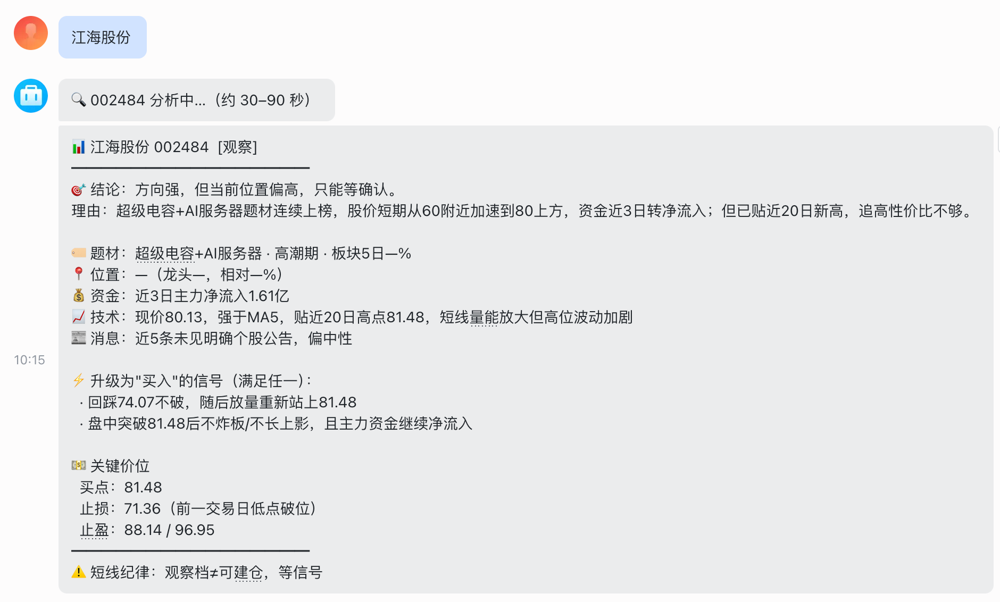
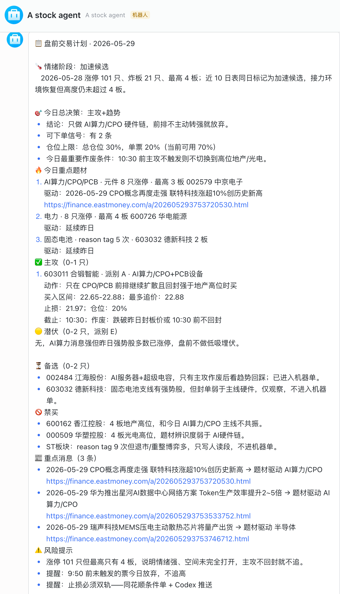

# A Stock Agent

基于可配置多 Agent 自动化调度的本地 A 股短线研究 Agent。

它把「盘前计划、盘中纪律、盘后复盘、周复盘、异动监控、随时问答」拆成一组可审计的 skill：先由确定性脚本拉取行情、题材、消息和持仓数据，形成 fact pack；再由 AI agent 生成交易研究卡片；最后通过飞书 / 个人微信推送给用户。

> 本项目只做研究、记录和提醒，不自动下单，不连接券商，不承诺收益。所有交易决策和实际下单都由使用者自行完成。

<p align="center">
  <a href="LICENSE"></a>
  <a href="pyproject.toml"></a>
  <a href="tests"></a>
  
</p>

## 项目状态

当前项目处于 **个人本地运行 / 早期开源** 阶段：

- 飞书和个人微信 iLink 是当前运行通道；飞书使用官方 WebSocket 长连，个人微信扫码登录、仅 1v1。
- 支持多种 AI agent 执行自动化任务（Codex / Claude Code / Cline / OpenClaw / Hermes / OpenCode / KimiCode），通过 `config/jobs.yaml` 或 `STOCK_AGENT` 环境变量切换。
- macOS 是主要支持环境；Linux 可运行部分 Python 逻辑，但 launchd 调度不适用。

如果你只是想体验单股/题材问答，先跑 `quickstart.sh` 即可。如果你想让它每天自动跑盘前、盘中、盘后和周复盘，需要安装自动化调度（默认使用 Codex）。

## 目录

- [核心定位](#核心定位)
- [架构和流程](#架构和流程)
- [示例](#示例)
- [适合谁](#适合谁)
- [功能概览](#功能概览)
- [三分钟快速开始](#三分钟快速开始)
- [完整自动化运行](#完整自动化运行)
- [多 Agent 自动化运行手册](docs/automations.md)
- [IM 接入](#im-接入)
- [IM gateway 运行手册](docs/im_gateway.md)
- [数据可信度和校验](#数据可信度和校验)
- [开发者](#开发者)

## 核心定位

A Stock Agent 不是普通行情脚本，也不是聊天机器人。它的核心是一个本机运行的 **AI Agent 工作流**：

```text
自动化调度到点触发（支持 Codex / Claude Code / Cline / OpenClaw / Hermes 等）
  -> 运行对应 stock-* skill
  -> skill 调用确定性脚本生成 fact pack
  -> AI agent 基于 fact pack 写研究卡片
  -> card validator 校验关键数据来源
  -> 飞书 / 微信推送
  -> SQLite 留痕，供后续复盘和下一轮分析使用
```

长时间轮询类任务不交给 LLM 常驻，而是由本地 daemon 负责：

```text
launchd 运行长时 daemon
  -> watch_loop / anomaly_loop / theme_emergence_loop
  -> 命中阈值后直接推送或写入上下文
  -> stock-* skill 在固定时点读取这些上下文做综合判断
```

这个设计的目标是：让 LLM 做它擅长的叙事、归因和决策整理，让确定性脚本负责数据抓取、状态记录、去重、校验和推送。

## 架构和流程

运行时分成三层：stock-* skills 负责研究任务，确定性 Python 模块负责数据和校验，IM gateway 负责用户入口和推送。SQLite 是中间状态和审计日志，不把关键状态藏在聊天上下文里。



每天的固定任务由自动化调度触发（`config/jobs.yaml` 定义，支持多种 AI agent），盘中长轮询交给 launchd daemon。这样做是为了让 LLM 只在需要归因和整理时运行，行情轮询、阈值判断和日志记录都留给可重复执行的脚本。



## 示例

以下图片来自本地运行截图，只展示输出形态和工作流，不构成投资建议。

**单股问答示例**

<p align="center">
  
</p>

**盘前计划推送示例**

<p align="center">
  
</p>

## 适合谁

- 你已经在做 A 股短线研究，希望把盘前、盘中、盘后流程固定下来。
- 你希望 AI agent 到点自动生成研究卡片，而不是每天手动整理行情和消息。
- 你希望通过飞书 / 微信随时问单股、题材、事件，但数据和记录仍保存在本机。
- 你能接受本项目需要本机环境、IM 机器人、AI agent CLI 和数据源共同稳定运行。

不适合：

- 想要自动交易或券商下单的人。
- 想要“稳赚信号”或黑盒荐股的人。
- 不愿意维护 token、持仓文件、本地数据库和定时任务的人。

## 功能概览

| 模块 | 入口 | 说明 |
|------|------|------|
| 盘前计划 | `stock-premarket` | 生成今日是否出手、主攻/潜伏/备选/禁买、仓位和触发条件。 |
| 盘中纪律 | `stock-intraday` | 09:30、09:45、11:30、14:30 四个时点输出纪律提醒或叙事快照。 |
| 盘后复盘 | `stock-postmarket` | 总结当日题材、情绪、消息、持仓处理和明日预案。 |
| 周复盘 | `stock-weekly` | 周日晚生成本周市场叙事、下周方向和候选主线。 |
| 异动汇总 | `stock-anomaly` | 把盘中异动日志聚类成“新方向是否冒头”的叙事卡片。 |
| 单股分析 | `stock-query` | 输入 6 位代码或股票名，输出买入/观察/回避或持仓处理建议。 |
| 随时分析 | `stock-ask` | 输入题材、事件或自由问题，自动路由到单股、板块或事件卡。 |
| IM 网关 | `channel_listener.py` | 统一处理飞书 WebSocket、微信 iLink 长轮询入站消息，连接绑定型通道经 outbox 出站。 |
| 本地审计 | SQLite | 记录入站命令、出站推送、决策票、运行状态和历史复盘。 |

## 三分钟快速开始

新用户建议先跑 IM 问答模式，把本地依赖、数据库、飞书配置和 IM 网关跑起来。微信需要扫码登录，通常在快速安装后单独配置：

```bash
git clone https://github.com/wispig66/a-stock-agent.git
cd a-stock-agent
bash scripts/quickstart.sh
```

脚本会检查或安装 `uv`，同步 Python 依赖，初始化 SQLite，创建 `.env`，写入飞书等通道默认配置，并启动统一 IM gateway。飞书凭证可在安装后运行 `scripts/configure_feishu.py` 写入；个人微信通过 `scripts/configure_weixin.py` 扫码登录。

这一步只代表 **随时问答入口可用**。启动成功后，你可以在飞书私聊机器人发送：

```text
/help
600519
/ask 光伏今天能不能看
```

常用选项：

```bash
# 只安装和初始化，不启动 IM gateway
bash scripts/quickstart.sh --no-start

# 安装后进入飞书配置向导
bash scripts/quickstart.sh --with-feishu

# 配置个人微信 iLink
uv run --no-sync python scripts/configure_weixin.py

# 安装后跑测试
bash scripts/quickstart.sh --test

# 非交互安装，适合脚本化部署（飞书凭证先写好 .env）
FEISHU_APP_ID=xxx FEISHU_APP_SECRET=yyy bash scripts/quickstart.sh
```

## 完整自动化运行

如果你要让系统每天自动跑盘前、盘中、盘后和周复盘，需要安装自动化调度和本地长时 daemon：

```bash
bash scripts/quickstart.sh --install-schedule
```

等价的手动步骤：

```bash
bash scripts/sync_codex_skills.sh
bash scripts/install_automations.sh install    # 统一入口，默认 Codex；可 --agent claude-code 切换
bash scripts/install_runtime_services.sh
```

切换 agent（详见 [docs/automations.md](docs/automations.md)）：

```bash
export STOCK_AGENT=claude-code
bash scripts/install_automations.sh install --replace
```

安装后运行诊断：

```bash
bash scripts/doctor_codex_runtime.sh
```

## 前置条件

| 依赖 | 说明 |
|------|------|
| macOS | 当前主要支持的运行环境；launchd 调度按 macOS 设计。 |
| AI agent CLI | 至少安装一种：Codex（默认）/ Claude Code / Cline / OpenClaw / Hermes / OpenCode / KimiCode。 |
| Python 3.11/3.12 | 由 `uv` 管理。 |
| SQLite | 保存本地运行状态和审计日志。 |
| 飞书 bot | 默认 IM 入口和推送通道；使用官方 WebSocket SDK，不需要公网 webhook。 |
| 个人微信 iLink | 当前启用的第二通道；扫码登录、仅 1v1，定时推送 best-effort。 |

如果只是开发或跑单元测试，AI agent CLI 和 IM 凭证不是必须的；如果要完整跑自动化研究流程，AI agent CLI、IM 通道和本机常驻环境都需要配置好。

## 手动安装

如果你不想使用快速脚本，可以手动执行：

```bash
git clone https://github.com/wispig66/a-stock-agent.git
cd a-stock-agent

uv sync --group dev
cp .env.example .env
mkdir -p data
sqlite3 data/daily.db < stock_codex/schema/init_db.sql
uv run --no-sync python scripts/migrate_channels.py
uv run --no-sync python -m stock_codex.tools.refresh_calendar
```

编辑 `.env`，至少填入：

```dotenv
CHANNEL_DEFAULT=feishu
CHANNELS_ENABLED=feishu,weixin
CHANNELS_NOTIFY=feishu,weixin
FEISHU_ENABLED=1
FEISHU_APP_ID=
FEISHU_APP_SECRET=
WEIXIN_TOKEN=
WEIXIN_HOME_CHANNEL=
```

建议用配置脚本写入飞书和微信凭证：

```bash
uv run --no-sync python scripts/configure_feishu.py
uv run --no-sync python scripts/configure_weixin.py
```

启动 IM gateway：

```bash
bash scripts/start_gateway.sh
```

重启和状态检查：

```bash
RESTART_GATEWAY=1 bash scripts/start_gateway.sh
cat data/channel_gateway_state.json
launchctl list | rg 'stockchannelgateway' || true
```

`start_gateway.sh` 后台运行 `stock_codex.apps.channel_listener`：按 `CHANNELS_ENABLED` 启动各通道 listener 和 outbox drain。停止时优先用 `launchctl remove com.user.stockchannelgateway`，临时排查也可以 `pkill -f stock_codex.apps.channel_listener`。

## 调度

本项目把运行时分成两类：

- **短时 LLM 任务**：到点运行一次 skill，生成卡片后退出。由 `config/jobs.yaml` 定义，支持多种 AI agent 调度（默认 Codex，可切换为 Claude Code / Cline / OpenClaw / Hermes / OpenCode / KimiCode）。
- **launchd 运行长时 daemon**：盘中常驻进程，负责不适合 LLM 长跑的轮询、阈值监控和 IM gateway 常驻。

| 类型 | 任务 | 入口 |
|------|------|------|
| 短时 LLM（多 agent） | 盘前计划 | `stock-premarket` |
| 短时 LLM（多 agent） | 盘中四个时点 | `stock-intraday-*` |
| 短时 LLM（多 agent） | 盘后复盘 | `stock-postmarket` |
| 短时 LLM（多 agent） | 周复盘 | `stock-weekly-review` |
| launchd 运行长时 daemon | 观察池/持仓轮询 | `com.user.stockwatchloop` |
| launchd 运行长时 daemon | 全市场异动监控 | `com.user.stockanomalyloop` |
| launchd 运行长时 daemon | 题材冒头监控 | `com.user.stockthemeloop` |

IM gateway 监听进程通过 `bash scripts/start_gateway.sh` 启动。macOS 下脚本会用 `launchctl submit` 挂起 `com.user.stockchannelgateway`，其他环境回退到 `nohup`。连接绑定型通道的出站发送依赖 gateway 持有的 listener 和 outbox drain，因此它必须常驻。

注意：如果仓库放在 `~/Desktop` 等受 macOS TCC 保护的目录，launchd 后台进程可能无法正常读取当前目录。更推荐放在 `~/code/a-stock-agent`，或者用 `bash scripts/start_gateway.sh` 在交互式终端里启动 IM gateway。

## IM 接入

当前默认只启用飞书和个人微信（`CHANNELS_ENABLED=feishu,weixin`）。飞书可以直接通过 HTTP API 主动推送；微信 iLink 是连接绑定型通道，主动推送会先写入 `channel_outbox`，再由常驻 gateway 持有的微信 listener 发送。

```dotenv
CHANNEL_DEFAULT=feishu
CHANNELS_ENABLED=feishu,weixin
CHANNELS_NOTIFY=feishu,weixin
```

完整操作手册见 [docs/im_gateway.md](docs/im_gateway.md)。

### 飞书

飞书使用官方 `lark-oapi` WebSocket SDK，不需要公网 webhook 地址。推荐通过向导配置：

```bash
uv run --no-sync python scripts/configure_feishu.py
```

飞书最小配置：

```dotenv
CHANNELS_ENABLED=feishu
CHANNELS_NOTIFY=feishu
FEISHU_ENABLED=1
FEISHU_APP_ID=
FEISHU_APP_SECRET=
FEISHU_HOME_CHANNEL=
FEISHU_ALLOWED_CHAT_IDS=
FEISHU_CONNECTION_MODE=websocket
FEISHU_REQUIRE_MENTION=true
FEISHU_CARD=true
```

飞书开放平台建议开启：

| 项 | 建议 |
|----|------|
| 连接方式 | 长连接 / WebSocket |
| 消息事件 | `im.message.receive_v1` |
| 菜单事件 | `application.bot.menu_v6` |
| 群聊策略 | 群聊默认需要 @bot，私聊直接响应 |

推荐菜单：

| 菜单 | `event_key` | 作用 |
|------|-------------|------|
| 帮助 | `help` | 发送帮助说明 |
| 单股分析 | `query` | 提示用户发送代码或股票名 |
| 随时分析 | `ask` | 提示用户使用 `/ask` |

`FEISHU_CARD=true` 时，markdown 推送会渲染成带彩色标题的交互卡片（看涨绿 / 看跌红 / 中性蓝）。

### 个人微信（iLink）

腾讯官方 iLink Bot（`ilinkai.weixin.qq.com`），扫码登录、仅 1v1（进不了普通群）。定时推送依赖 per-peer context_token 的新鲜度，属 best-effort；飞书仍是更稳定的主推送通道。

```bash
uv run --no-sync python scripts/configure_weixin.py
```

向导会请求登录二维码、等你扫码确认，并把 `WEIXIN_TOKEN` / `WEIXIN_BASE_URL` 写入 `.env`。启用后先在微信里给机器人私聊一条消息，gateway 会把 peer 对应的 context token 写入 `data/weixin_context_tokens.json`。如果要让定时任务默认推到这个微信会话，把该 peer id 写入 `WEIXIN_HOME_CHANNEL`。

常用检查：

```bash
uv run --no-sync python scripts/migrate_channels.py
RESTART_GATEWAY=1 bash scripts/start_gateway.sh
uv run --no-sync python -m stock_codex.infra.notify test

sqlite3 data/daily.db "SELECT channel, status, attempts FROM channel_outbox ORDER BY id DESC LIMIT 5;"
sqlite3 data/daily.db "SELECT channel, success, source FROM channel_outbound_log ORDER BY id DESC LIMIT 8;"
```

`notify test` 应该同时写入飞书和微信出站日志。微信最近一条 `channel_outbox.status` 应为 `sent`。

## 数据可信度和校验

项目要求研究卡片里的关键事实来自 fact pack，而不是模型凭印象编写。

- scheduled skills 会生成 `ALLOWED` 事实白名单。
- `push.py` 在推送前调用 `card_validator` 校验股票代码、股名、涨跌幅、连板数、涨停/炸板数量等关键字段。
- 定时任务默认以 enforce 思路运行：数据不在 fact pack 中，就不应该作为事实写进卡片。
- 所有推送和入站命令会写入 SQLite，便于复盘和追踪问题。

这套机制不能保证投资结论正确，但能减少“模型编数据”的风险。

## 项目结构

```text
.agents/skills/          skill 定义：盘前、盘中、盘后、周复盘、异动、问答
stock_codex/             Python 包
  apps/                  runtime 入口
  channels/              飞书 / 微信 gateway adapter
  domain/                交易日历、持仓、风控、决策票
  infra/                 SQLite、日志、通知
  market/                行情、题材、事件、卡片校验
  schema/                SQLite schema
scripts/                 安装、迁移、诊断、配置脚本
bin/                     手动或 launchd runtime 入口
launchd/                 launchd 模板
tests/                   pytest 测试
docs/                    运行手册和设计文档
```

## 常用命令

```bash
# 快速安装/启动
bash scripts/quickstart.sh

# 安装自动化调度和 launchd daemon
bash scripts/quickstart.sh --install-schedule

# 诊断本机运行环境
bash scripts/doctor_codex_runtime.sh

# 启动/停止 IM gateway
bash scripts/start_gateway.sh
pkill -f stock_codex.apps.channel_listener

# 配置飞书
uv run --no-sync python scripts/configure_feishu.py

# 配置个人微信 iLink
uv run --no-sync python scripts/configure_weixin.py

# 刷新交易日历
uv run --no-sync python -m stock_codex.tools.refresh_calendar

# 运行测试
uv run --no-sync pytest -q
```

## 数据源

| 数据源 | 用途 |
|--------|------|
| AKShare | A 股行情、交易日历、涨跌停、异动等基础数据。 |
| 同花顺/东方财富/财联社 | 题材归因、榜单、新闻和行情 fallback。 |

数据源可能限流、变更字段、受代理规则影响。项目会尽量降级处理，但不能保证任何第三方数据源永远可用。

## 开发者

开发环境：

```bash
uv sync --group dev
uv run --no-sync pytest -q
```

提交前建议：

```bash
git diff --check
uv run --no-sync pytest -q
```

贡献方向：

- skill contract 和 fact pack 质量。
- 数据源字段变更适配和降级策略。
- 飞书 / 微信 gateway 稳定性。
- 更多 IM adapter。
- 卡片校验、复盘记录、风险提示和文档体验。

提交 PR 前请阅读 [CONTRIBUTING.md](CONTRIBUTING.md)。安全问题请看 [SECURITY.md](SECURITY.md)，不要在公开 issue 里贴 token、chat id、持仓或日志。

## 致谢

- [AKShare](https://github.com/akfamily/akshare)：A 股行情、交易日历和市场数据。
- [simonlin1212/a-stock-data](https://github.com/simonlin1212/a-stock-data)：部分扩展数据源封装参考，保留 Apache 2.0 attribution。

## 许可证

MIT，见 [LICENSE](LICENSE)。

## 免责声明

本项目仅用于学习、研究、记录和提醒，不构成投资建议、交易建议、法律建议或税务建议。所有交易由使用者自行判断并手工执行，任何收益或损失由使用者自行承担。
